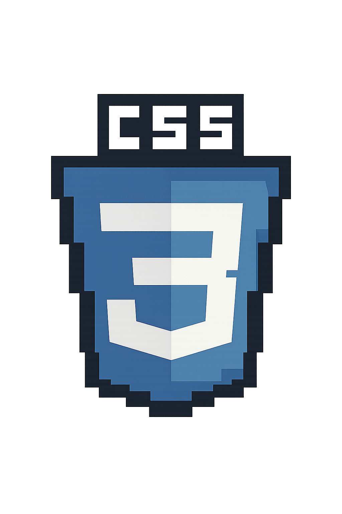
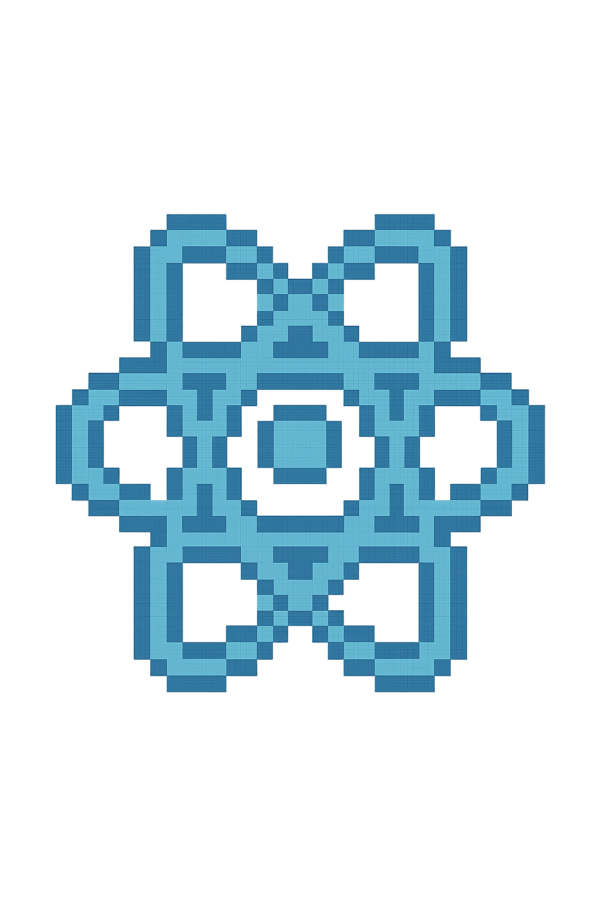
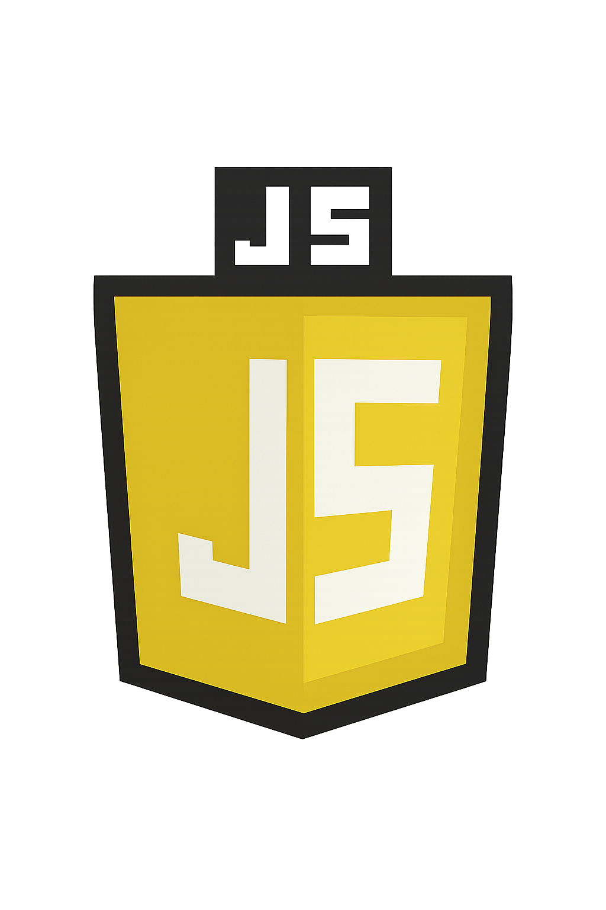
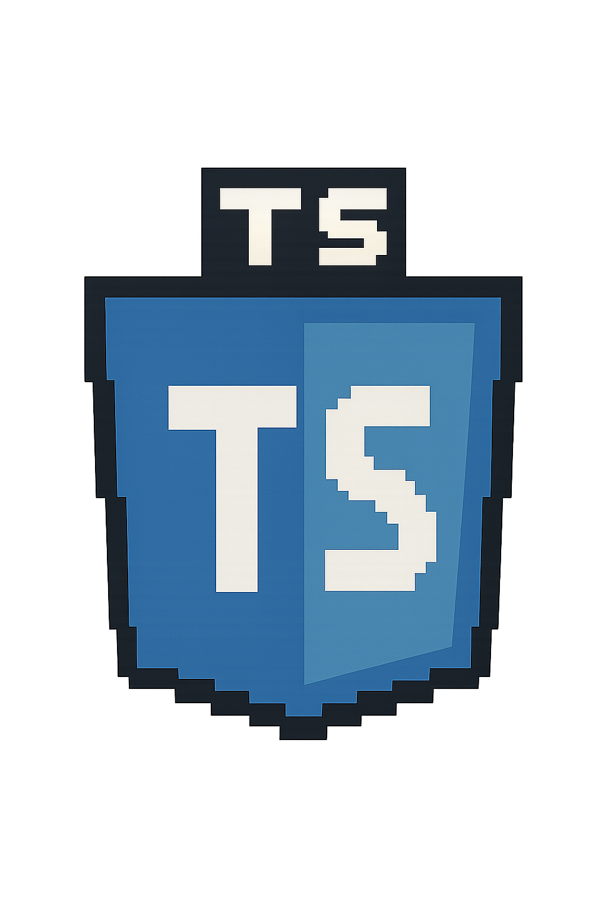
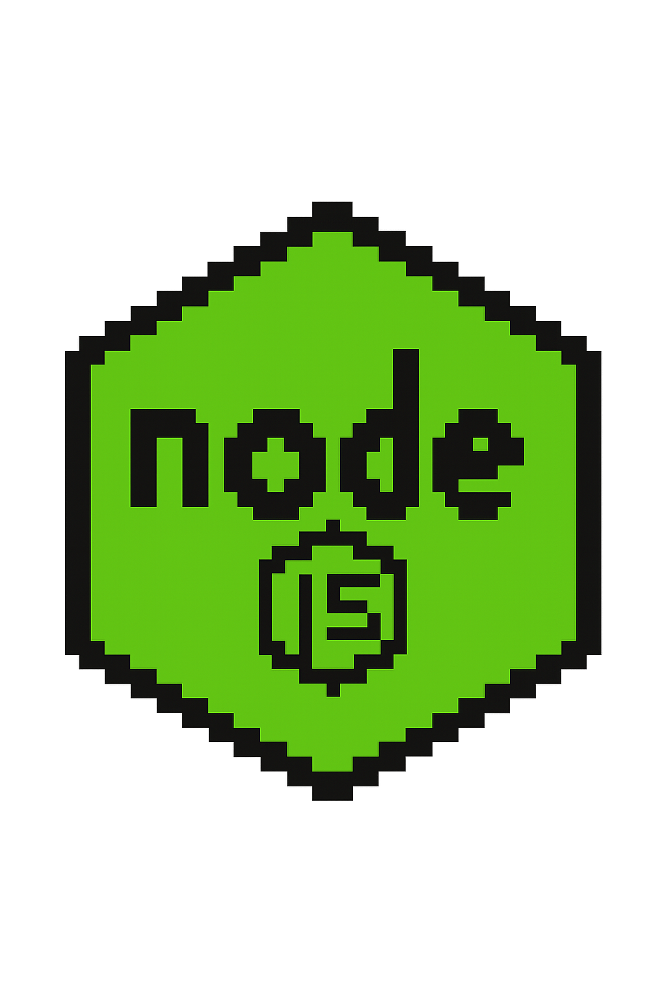
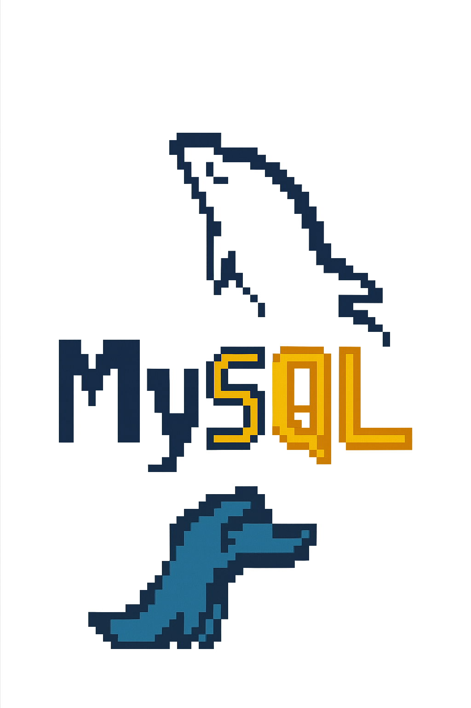
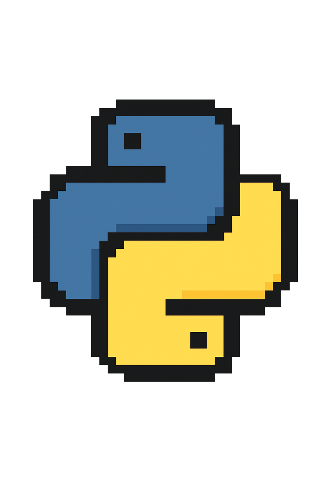

## 📂 Sobre/💌 Fernanda/

<table>
  <tr>
    <td valign="top" width="70%">

├── 👩‍💻 Desenvolvedora FullStack Javascript | SP BR  
├── 🎓 Estudante de **Engenharia de Software**  
├── 🎨 **ilustradora** nas horas vagas 
├── 📂 Mural_de_Recados/  
│ ├── 🚧 Em construção... cuidado com os bugs! 🐛  
│ ├── 💼 Em busca de novos desafios.. sempre aprendendo  
│ └── 📬 Growth is not a race — knowledge blooms in its own season

└── 📂 Entre em Contato/  
  └── 🔗 [LinkedIn](https://www.linkedin.com/in/fern-menezes/)

</td>
    <td valign="top" width="30%" align="center">

</td>
  </tr>
</table>

---

### 📈 Estatísticas

  

---

<table>
  <tr>
    <td valign="top" width="100%">

## 📂 Habilidades/
├── 🎨 **Frontend**/  
│ ├── HTML  
│ ├── CSS  
│ ├── React  
│ ├── JavaScript  
│ └── TypeScript  
└───🛠️ **Backend**/  
  ├── Node.js  
  ├── MySQL  
  ├── Python  
  └── C  

</td>
</table>
