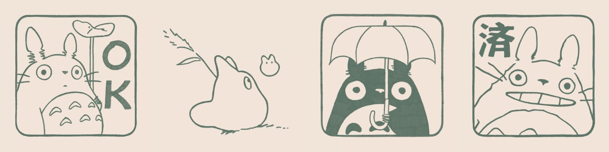

 

 
  
 

<h2 align="center">♡ About</h2>

Apaixonada por tecnologia, adoro criar aplicações web que resolvem problemas reais. Tenho grande interesse pela área de cibersegurança e design (UI/UX).

🎓 Engenharia de Software – 1º semestre   
📊 Formada em Administração    
💻 Pós-graduação em Análise de Sistemas    
🔐 Pós-graduação em Cibersegurança (em andamento)    
🧠 Certificação: Desenvolvedora Full Stack    
🛠️ Portfólio em construção    
🎨 Faço desenhos como hobby    
   
 

 
<h2 align="center"> ♡ Technologies</h2>

  
  
  
  
  
  
  
  
  
  
  
  
  
  
  
  
  
  
  

 
<h2 align="center"> ♡ Statistics</h2>
  

  

